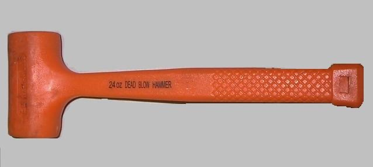
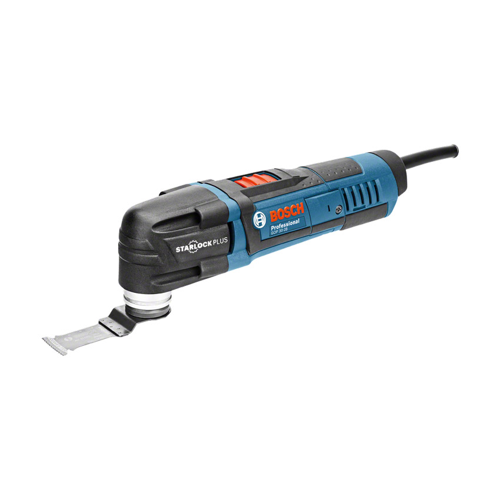
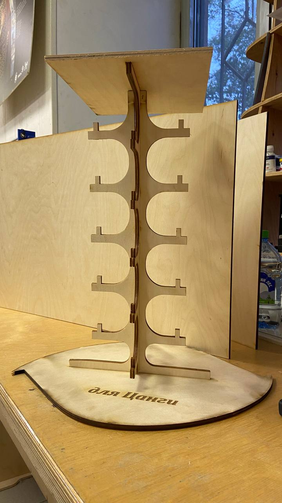
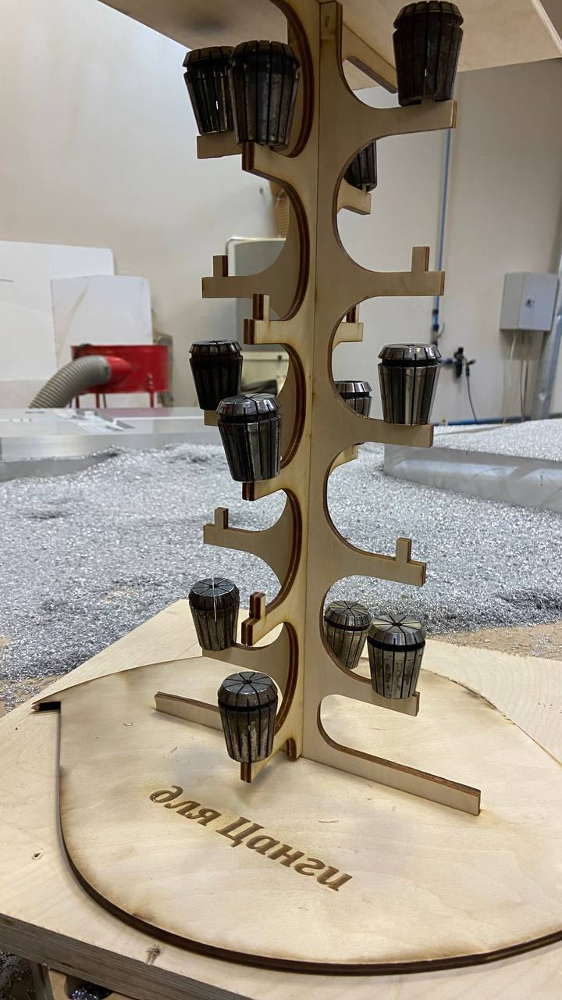

# Сделать органайзер для цанги

**Исследование**

С перво начала было ознакомления имеющих органайзеров в [интернете](https://www.google.com/search?q=organizer+for+collet&rlz=1C1GCEA_enUZ944UZ944&oq=organizer+for+collet&gs_lcrp=EgZjaHJvbWUyBggAEEUYOTIGCAEQRRg8MgYIAhBFGDwyBggDEEUYPNIBCTIxOTc3ajFqN6gCALACAA&sourceid=chrome&ie=UTF-8&bshm=rimc/1).Результаты почти были похожи друг на друга.Многие были из пластмассы в виде ящика.

**Идея**

Надо было подумать самый оптимальный вариант и выбрать один из них согласно с экономию материала .

**Моделирование**

Программное обеспечение : Копмас-3D , CorelDraw

**Fabrication и сборка**

Для изготовление органайзера было выбрано :

- для основной части : 3мм фанерные листы  
- для верхний и нижний часть : 6мм фанеры(они были выбраны из остатков предыдущих сделок)

  Сборка органайзера было с помощью следуюшего инструмента

Инертный молоток

Универсальный резак
  

Рис1.Сборка органайзера

 **Тестирование**

